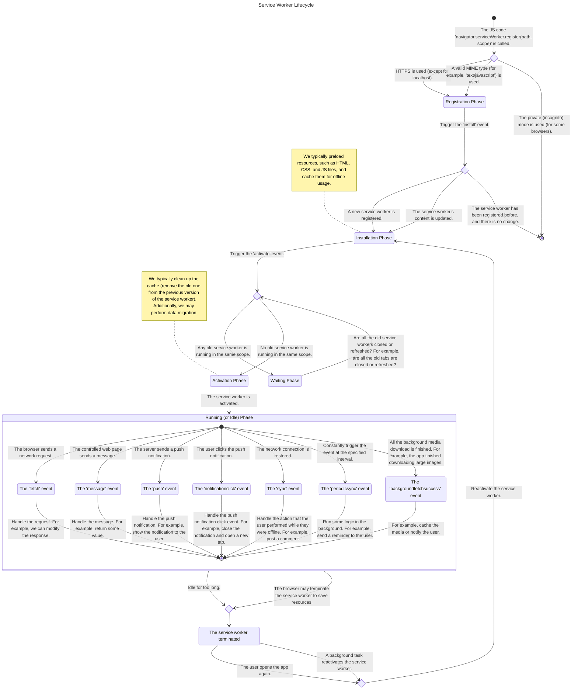

## Disclaimer

I created this note mostly from reading.

I have not tested everything yet.

## State Diagram

```mermaid
---
title: Service Worker Lifecycle
---
stateDiagram-v2
  state register_condition <<choice>>
  [*] --> register_condition: The JS code 'navigator.serviceWorker.register(path, scope)' is called.
  state "Registration Phase" as register
  register_condition --> register: HTTPS is used (except for localhost).
  register_condition --> register: A valid MIME type (for example, 'text/javascript') is used.
  register_condition --> [*]: The private (incognito) mode is used (for some browsers).
  state install_condition <<choice>>
  register --> install_condition: Trigger the 'install' event.
  state "Installation Phase" as install
  note left of install
    We typically preload resources, such as HTML, CSS, and JS files, and cache them for offline usage.
  end note
  install_condition --> install: A new service worker is registered.
  install_condition --> install: The service worker's content is updated.
  install_condition --> [*]: The service worker has been registered before, and there is no change.
  state activate_condition <<choice>>
  install --> activate_condition: Trigger the 'activate' event.
  state "Activation Phase" as activation
  note left of activation
    We typically clean up the cache (remove the old one from the previous version of the service worker).
    Additionally, we may perform data migration.
  end note
  state "Waiting Phase" as wait
  activate_condition --> wait: Any old service worker is running in the same scope.
  wait --> activate_condition: Are all the old service workers closed or refreshed? For example, are all the old tabs are closed or refreshed?
  activate_condition --> activation: No old service worker is running in the same scope.
  state "Running (or Idle) Phase" as running {
    state "The 'fetch' event" as fetch
    [*] --> fetch: The browser sends a network request.
    fetch --> [*]: Handle the request. For example, we can modify the response.
    state "The 'message' event" as message
    [*] --> message: The controlled web page sends a message.
    message --> [*]: Handle the message. For example, return some value.
    state "The 'push' event" as push
    [*] --> push: The server sends a push notification.
    push --> [*]: Handle the push notification. For example, show the notification to the user.
    state "The 'notificationclick' event" as notificationclick
    [*] --> notificationclick: The user clicks the push notification.
    notificationclick --> [*]: Handle the push notification click event. For example, close the notification and open a new tab.
    state "The 'sync' event" as sync
    [*] --> sync: The network connection is restored.
    sync --> [*]: Handle the action that the user performed while they were offline. For example, post a comment.
    state "The 'periodicsync' event" as periodicsync
    [*] --> periodicsync: Constantly trigger the event at the specified interval.
    periodicsync --> [*]: Run some logic in the background. For example, send a reminder to the user.
    state "The 'backgroundfetchsuccess' event" as backgroundfetchsuccess
    [*] --> backgroundfetchsuccess: All the background media download is finished. For example, the app finished downloading large images.
    backgroundfetchsuccess --> [*]: For example, cache the media or notify the user.
  }
  activation --> running: The service worker is activated.
  state terminate_condition <<choice>>
  running --> terminate_condition: Idle for too long.
  running --> terminate_condition: The browser may terminate the service worker to save resources.
  state "The service worker terminated" as terminated
  terminate_condition --> terminated
  state reactivate_condition <<choice>>
  terminated --> reactivate_condition: The user opens the app again.
  terminated --> reactivate_condition: A background task reactivates the service worker.
  reactivate_condition --> install: Reactivate the service worker.
```
